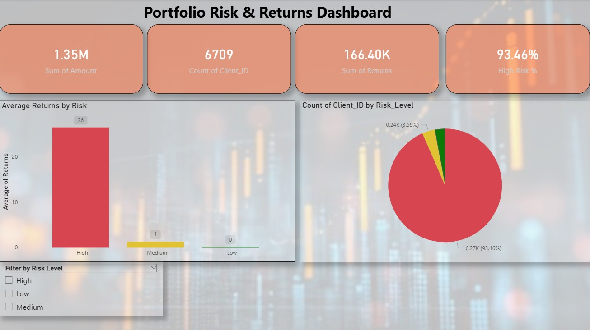

Portfolio Risk & Returns Analysis Dashboard

Objective

This project simulates a real-world wealth management scenario to analyze client investment portfolios, focusing on risk distribution, return performance, and portfolio optimization.

---

Tools Used

* Power BI (Dashboard & Visualization)
* SQL (Data Analysis)
* Excel / CSV (Dataset)
* GitHub (Project Hosting)

---

Dataset

The dataset consists of:  

* Client_ID
* Investment_Type
* Amount
* Returns (%)
* Risk_Level (High / Medium / Low)

Total Records: **6709 clients**

---

Key KPIs

* Total Investment: **$1.34M**
* Average Returns: **24.80%**
* Total Clients: **6709**
* High Risk Clients: **93.46%**

---

Dashboard

---

Key Insights

* **93%+ of portfolios are High Risk**, indicating extreme concentration
* High Risk investments generate **highest returns (~26.49%)**
* Medium & Low risk investments show **very low returns (1.22% / 0.07%)**
* **Negative correlation (-0.83)** between investment size and returns
* Portfolio lacks diversification, heavily biased toward high-risk assets
* Top clients contribute a significant portion of total investment

---

 Analysis

Key queries performed:

* Total investment calculation
* Average returns by risk level
* Risk distribution analysis
* Identification of top clients

---
Business Impact

This analysis helps wealth management firms to:

* Identify over-exposed high-risk clients
* Improve portfolio diversification strategies
* Optimize risk-adjusted returns
* Target high-value clients for better advisory

---

Conclusion

The project highlights the importance of balancing risk and return in portfolio management and demonstrates how data analytics can drive better financial decision-making.
